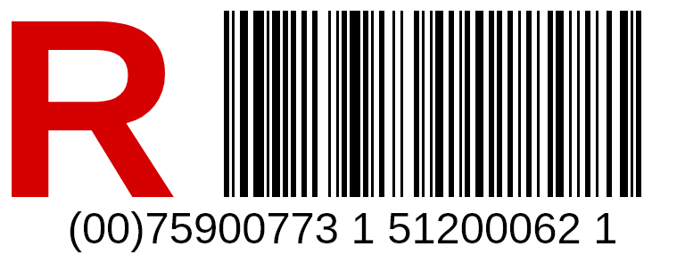

# Mass.RLabel

> Dokumentacja użytkownika i integracji (nalepki R i walidacja pism razem): [../docs/README.md](../docs/README.md).

Biblioteka .NET 8 generująca grafikę nalepki „R” listu poleconego: czerwona litera R w ramce, kod kreskowy numeru nadawczego i numer w postaci czytelnej. Wynik to PNG albo JPEG, dostępny jako bajty, Base64 lub `data:` URI.

Działa na Windows i Linux (w tym w kontenerach GCP: Cloud Run, GKE) bez fontów systemowych i bez bibliotek graficznych Windows. Wszystkie składniki są darmowe:

| Składnik | Licencja | Rola |
|---|---|---|
| [SkiaSharp](https://github.com/mono/SkiaSharp) 4.153 | MIT | rasteryzacja i kodowanie PNG/JPEG |
| SkiaSharp.NativeAssets.Linux.**NoDependencies** | MIT | natywna Skia dla Linuksa bez wymagań na `libfontconfig` i inne biblioteki systemowe |
| Liberation Sans (osadzony w DLL) | SIL OFL 1.1 | tekst na nalepce, identyczny na każdym systemie |
| koder Code 128 / GS1-128, metadane DPI | własny kod | bez zależności |

## Użycie

```csharp
using Mass.RLabel;

IRegisteredLabelRenderer renderer = new RegisteredLabelRenderer();   // bezstanowy, można jako singleton

// najprościej: Base64 PNG, 65×25 mm, 300 DPI
string base64 = renderer.RenderBase64("00759007731512000621", MailType.Domestic);
string base64Intl = renderer.RenderBase64("RR473124829PL", MailType.International, widthMm: 65, heightMm: 25, format: LabelImageFormat.Jpeg);

// pełna kontrola
var image = renderer.Render(new RegisteredLabelRequest
{
    Number = "(00) 7 5900773 1 51200062 1",   // zapis z nalepki jest akceptowany
    Type = MailType.Domestic,
    WidthMm = 100,
    HeightMm = 40,
    Dpi = 600,
    Format = LabelImageFormat.Png,
});

image.Bytes;                 // zawartość pliku
image.Base64;                // to samo w Base64
image.DataUri;               // "data:image/png;base64,..."
image.ContentType;           // "image/png" / "image/jpeg"
image.WidthPx; image.HeightPx; image.Dpi;
image.HumanReadableNumber;   // "(00)75900773 1 51200062 1"
image.BarcodeModuleMm;       // szerokość najwęższej kreski, np. 0,254 mm
```

Rejestracja w DI: `services.AddSingleton<IRegisteredLabelRenderer, RegisteredLabelRenderer>();`

### Parametry (`RegisteredLabelRequest`)

| Parametr | Domyślnie | Uwagi |
|---|---|---|
| `Number` | – | krajowy: 20 cyfr SSCC z „00”; zagraniczny: S10 `RR473124829PL`. Spacje, nawiasy, myślniki i małe litery są pomijane. |
| `Type` | – | `Domestic` (GS1-128) albo `International` (Code 128) |
| `WidthMm` × `HeightMm` | 65 × 25 | dowolne w zakresie 0–500 mm |
| `Dpi` | 300 | 72–2400; zapisywane w pliku (PNG `pHYs`, JPEG JFIF), więc drukarka zachowa wymiar w mm. Drukarki termiczne mają zwykle 203 lub 300 DPI. |
| `Format` | `Png` | `Jpeg` dostępny; do druku i skanowania lepszy jest PNG (bezstratny) |
| `JpegQuality` | 92 | 1–100 |
| `DrawBorder` | `false` | ramka wokół nalepki; oryginalna nalepka jej nie ma |
| `ValidateCheckDigit` | `true` | zła cyfra kontrolna to `ArgumentException` z podaniem, jaka jest i jaka powinna być |

Cyfry kontrolne liczone są tym samym algorytmem co w aplikacji Mass (GS1 mod 10 dla SSCC, UPU S10 ważony mod 11), numery wzorcowe z `ku_ku_lafila.md` są w testach.

### Kod kreskowy

- **Krajowy:** GS1-128 (Start C, FNC1, AI 00 + 18 cyfr w zestawie C). Skaner rozpoznaje go jako GS1 i zwraca `(00)759007731512000621`.
- **Zagraniczny:** Code 128, litery w zestawie B, 8 cyfr serialu w zestawie C.
- Moduł (najwęższa kreska) ma zawsze całkowitą liczbę pikseli, więc krawędzie są ostre. Przy 65 mm i 300 DPI moduł ma 0,254 mm (3 px); przy 203 DPI 0,25 mm (2 px). Cicha strefa po obu stronach: 10 modułów.
- Wygenerowane próbki zostały odczytane dekoderem zxing-cpp: wszystkie sześć (PNG i JPEG, 203–600 DPI, 50–100 mm) dekodują się do właściwego numeru.

### Wyjątki

`ArgumentException` dla złego numeru (format, cyfra kontrolna, niezgodność z rodzajem), złych wymiarów, DPI spoza zakresu albo nalepki za wąskiej na kod (poniżej ok. 120 px szerokości). Wszystkie komunikaty są po polsku.

## Wdrożenie na Linux (GCP)

Nic dodatkowego nie trzeba instalować. Pakiet `SkiaSharp.NativeAssets.Linux.NoDependencies` jest zależnością biblioteki i przechodzi do aplikacji automatycznie; zawiera `libSkiaSharp.so` dla `linux-x64`, `linux-arm64` i wariantów `musl` (Alpine). Fonty są w DLL. Sprawdzone w kontenerze `mcr.microsoft.com/dotnet/sdk:8.0` (Debian 12, bez fontconfig i bez żadnych fontów): 42 testy przechodzą, generator próbek działa, a nalepki z Linuksa dekodują się do tych samych numerów co z Windows. Pliki nie są identyczne bajt w bajt (inna kompresja PNG i drobne różnice rasteryzacji między buildami Skii), ale wymiary, DPI i treść kodu są te same.

Uwaga: nie dodawaj do aplikacji pakietu `SkiaSharp.NativeAssets.Linux` (bez `NoDependencies`). Oba dostarczają ten sam plik `.so`, a wersja bez `NoDependencies` wymaga `libfontconfig1` w obrazie.

## Wygląd nalepki



Układ jest wzorowany na nalepce R Poczty Polskiej: bez obramowania, po lewej duża czerwona litera R o wysokości kodu kreskowego, po prawej kod, pod nimi numer na całą szerokość w zapisie z nalepki (`(00)75900773 1 51200062 1`). Kolor R to `RegisteredLabelRenderer.RegisteredRed` (#D50000). Proporcje są zachowane przy dowolnych wymiarach, a teksty są pomniejszane, gdy nie mieszczą się w szerokości. Układ odtworzono ze zdjęcia nalepki, nie z oficjalnego wzoru, więc przed drukiem warto porównać go z egzemplarzem z Poczty (`Draw` w `RegisteredLabelRenderer`).

## Struktura

```
RLabel/
├─ src/Mass.RLabel/
│  ├─ IRegisteredLabelRenderer.cs     interfejs publiczny
│  ├─ RegisteredLabelRenderer.cs      układ nalepki i rysowanie (SkiaSharp)
│  ├─ Model/                          MailType, LabelImageFormat, RegisteredLabelRequest, RegisteredLabelImage
│  ├─ Numbers/RegisteredNumber.cs     normalizacja numeru, cyfry kontrolne, postać czytelna
│  ├─ Barcode/Code128.cs              koder Code 128 / GS1-128
│  ├─ Imaging/                        osadzone fonty, zapis DPI do PNG/JPEG
│  └─ Fonts/                          Liberation Sans + licencja OFL
├─ tests/Mass.RLabel.Tests/           xUnit (42 testy)
└─ samples/                           6 przykładowych nalepek + generator (dotnet run w samples/SampleGenerator)
```

```
dotnet test Mass/RLabel/Mass.RLabel.sln
```
