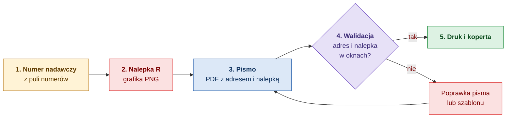
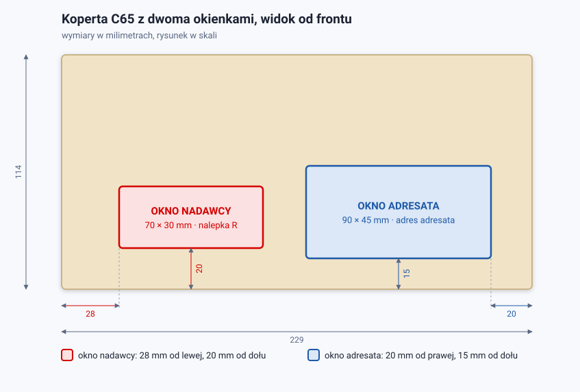
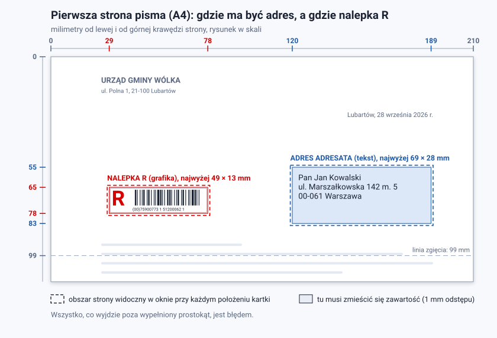

# List polecony w kopercie z okienkiem: dokumentacja

Dokumentacja dwóch mechanizmów, które razem odpowiadają na pytanie „czy to pismo można wydrukować, włożyć do koperty z okienkiem i nadać jako polecone”:

- **Generowanie nalepki R** (`Mass.RLabel`): z numeru nadawczego powstaje grafika nalepki z literą R, kodem kreskowym i numerem.
- **Walidacja pisma** (`Mass.AddressWindow`): sprawdzenie, czy na pierwszej stronie pisma adres adresata trafia w okno adresata, a nalepka R w okno nadawcy.

## Co czytać

| Jeśli… | Czytaj |
|---|---|
| przygotowujesz pisma lub szablony i chcesz wiedzieć, gdzie co ma być i jak czytać wynik sprawdzenia | [Przewodnik użytkownika](przewodnik-uzytkownika.md) |
| dostałeś komunikat i chcesz wiedzieć, co znaczy i co poprawić | [Zgłoszenia walidacji](zgloszenia.md) |
| wpinasz generowanie nalepek lub walidację we własny system | [Integracja](integracja.md) |
| chcesz zrozumieć, skąd biorą się wymiary, reguły i wyniki | [Jak to działa](jak-to-dziala.md) |

## Całość w pięciu krokach

| Krok | Kto to robi |
|---|---|
| 1 | pula numerów, `Rokoko/Mass.Api` |
| 2 | generator nalepek, `Mass.RLabel` |
| 3 | system, który generuje pisma |
| 4 | walidacja pisma, `Mass.AddressWindow` |
| 5 | drukarnia lub kopertownica |

1. **Numer.** Każdy list polecony ma niepowtarzalny numer nadawczy. Numery pochodzą z puli zasilonej z rolek nalepek ([Rokoko/README.md](../../Rokoko/README.md)).
2. **Nalepka.** `Mass.RLabel` zamienia numer na grafikę nalepki. Przy okazji sprawdza format numeru i cyfrę kontrolną.
3. **Pismo.** Generator pism wstawia adres adresata i grafikę nalepki w ustalone miejsca pierwszej strony.
4. **Walidacja.** `Mass.AddressWindow` sprawdza gotowy plik. W oknie adresata ocenia położenie i treść adresu. W oknie nadawcy sprawdza tylko, czy nalepka R jest i czy się mieści.
5. **Druk.** Pismo, które przeszło walidację, po złożeniu na trzy pokaże w okienkach to, co trzeba, niezależnie od tego, jak kartka ułoży się w kopercie.

## Koperta i strona na jednym spojrzeniu

Koperta C65 z dwoma okienkami. Przez prawe widać adres adresata, przez lewe nalepkę R:

Ta sama geometria przeniesiona na pierwszą stronę pisma. Tu muszą trafić adres i nalepka:

## Najważniejsze liczby

Wszystkie dotyczą domyślnego układu: kartka A4 w pionie, koperta C65 (229×114 mm). Położenia są liczone w milimetrach od lewego górnego rogu pierwszej strony.

| | Okno adresata | Okno nadawcy |
|---|---|---|
| Co ma w nim być | adres adresata (tekst) | nalepka R (grafika) |
| Strona kartki | prawa | lewa |
| Zawartość musi się zmieścić w | x 120–189, y 55–83 mm | x 29–78, y 65–78 mm |
| Największy rozmiar zawartości | 69×28 mm | **49×13 mm** |
| Sprawdzane w trybie | jednego i dwóch okienek | tylko dwóch okienek |

## Sprawa otwarta: rozmiar nalepki

Domyślna nalepka z `Mass.RLabel` ma **65×25 mm**, a w oknie nadawcy koperty C65 mieści się najwyżej **49×13 mm**. Nalepka w domyślnym rozmiarze zawsze dostanie błąd `LABEL_TOO_LARGE`. Mniejsza nalepka ma węższe kreski kodu, co może utrudnić skanowanie. Warianty, zmierzone szerokości kresek i to, co trzeba zdecydować, opisuje [Jak to działa, sekcja „Nalepka a okno”](jak-to-dziala.md#nalepka-a-okno-co-się-mieści).

## Czego ta dokumentacja nie obejmuje

- Zasilania puli numerów i cyklu życia numeru: [Rokoko/README.md](../../Rokoko/README.md), budowa numerów i dane testowe: [ku_ku_lafila.md](../ku_ku_lafila.md).
- Opisu klas i opcji bibliotek w pełnym zakresie: [AddressWindow/README.md](../AddressWindow/README.md), [RLabel/README.md](../RLabel/README.md).
- Plików do prób z oczekiwanymi wynikami: [AddressWindow/samples/README.md](../AddressWindow/samples/README.md).

## Słownik

| Pojęcie | Znaczenie |
|---|---|
| Nalepka R, „R-ka” | Oznaczenie listu poleconego: czerwona litera R, kod kreskowy i numer nadawczy. |
| Numer nadawczy | Niepowtarzalny numer przesyłki. Krajowy ma 20 cyfr, zagraniczny 13 znaków. |
| Cyfra kontrolna | Cyfra wyliczona z pozostałych cyfr numeru. Wykrywa literówki. |
| Okno adresata | Okienko koperty po prawej stronie, przez które widać adres. |
| Okno nadawcy | Drugie okienko koperty, po lewej. W tym rozwiązaniu jest w nim nalepka R, a nie adres nadawcy. |
| Obszar widoczny zawsze | Część strony, którą widać w oknie przy każdym położeniu kartki w kopercie. Mniejsza od samego okna, bo kartka ma w kopercie luz. |
| Tryb jednego / dwóch okienek | Rodzaj koperty wybierany przy sprawdzaniu. Decyduje, czy sprawdzane jest także okno nadawcy. |
| Zgłoszenie | Pojedynczy wynik walidacji: stały kod, waga (błąd, ostrzeżenie, informacja) i komunikat po polsku. |
| Moduł kodu | Szerokość najwęższej kreski kodu kreskowego. |
