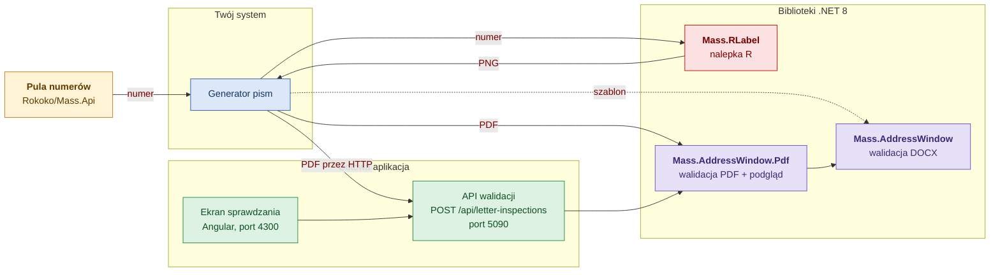
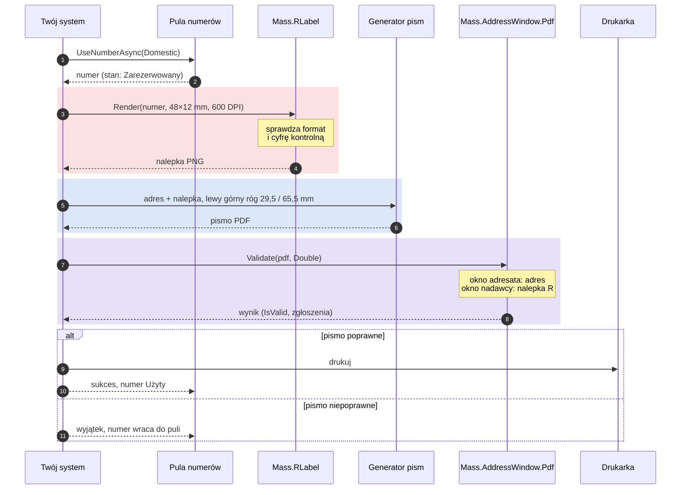
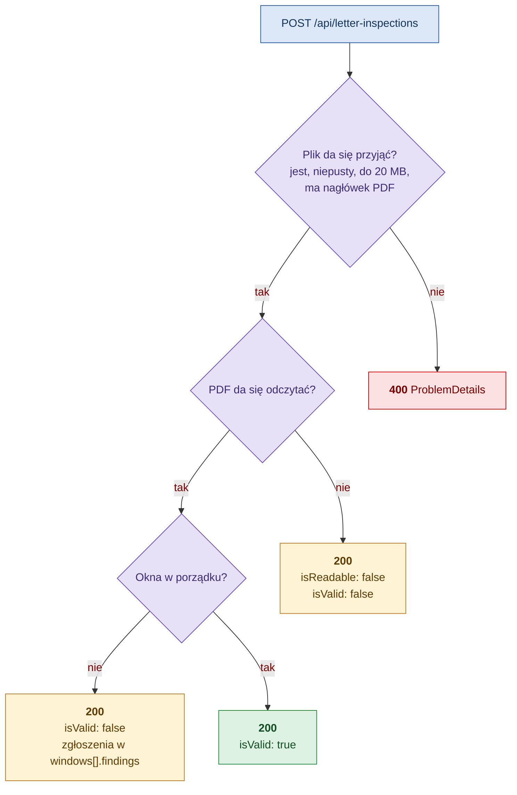

# Integracja

Dla programistów, którzy wpinają generowanie nalepek R i walidację pism we własny system.

[← Spis dokumentacji](README.md)

## Co jest do dyspozycji

| Składnik | Rola | Jak się go używa | Gdzie |
|---|---|---|---|
| `Mass.RLabel` | generuje grafikę nalepki R z numeru | biblioteka .NET 8 | `Mass/RLabel/src/Mass.RLabel` |
| `Mass.AddressWindow.Pdf` | waliduje PDF, zwraca podgląd strony | biblioteka .NET 8 | `Mass/AddressWindow/src/Mass.AddressWindow.Pdf` |
| `Mass.AddressWindow` | waliduje DOCX | biblioteka .NET 8 | `Mass/AddressWindow/src/Mass.AddressWindow` |
| API walidacji | waliduje PDF przez HTTP | REST, `POST /api/letter-inspections` | `Mass/AddressWindow/app/api` |
| Aplikacja walidacji | ekran dla użytkownika | przeglądarka | `Mass/AddressWindow/app/ui` |
| Pula numerów | wydaje numery nadawcze | REST albo `IRegisteredNumberDispenser` | `Rokoko/Mass.Api` |



Linia przerywana to wariant opcjonalny: sprawdzanie szablonu Worda przed wygenerowaniem pism.

Trzy rzeczy, o które zwykle pada pytanie:

- **Generowanie nalepek nie ma endpointu HTTP.** Jest tylko biblioteką. Jeśli potrzebujesz go przez HTTP, wystaw własny endpoint ([przykład niżej](#nalepka-przez-http)).
- **API walidacji przyjmuje tylko PDF.** DOCX waliduje się biblioteką `Mass.AddressWindow` bezpośrednio.
- **Biblioteki nie są opublikowane jako pakiety NuGet.** Dodaje się je przez `ProjectReference`.

Wszystkie biblioteki działają na Windows i Linux bez instalowania czegokolwiek w systemie: natywne zależności są w pakietach NuGet, fonty są osadzone w DLL. Walidatory i generator są bezstanowe i bezpieczne wątkowo, rejestruje się je jako singletony.

## Który wariant wybrać

| Sytuacja | Wybierz |
|---|---|
| Twój system jest w .NET i generuje pisma | biblioteki bezpośrednio |
| Twój system nie jest w .NET albo chcesz luźnego powiązania | API walidacji przez HTTP |
| Ludzie mają sprawdzać pojedyncze pisma ręcznie | aplikacja |
| Chcesz sprawdzać szablony Worda przed wygenerowaniem pism | biblioteka `Mass.AddressWindow` |

Waliduj plik, który trafi do druku. PDF zawiera gotowy skład strony, więc położenia są dokładne. W DOCX część położeń jest szacowana ([Jak to działa](jak-to-dziala.md#pdf-a-docx-czym-różnią-się-wyniki)).

## Przepływ od numeru do wydruku



To samo w kodzie:

```csharp
// 1. numer z puli; jest Zarezerwowany do końca bloku, po sukcesie Użyty, po wyjątku wraca do puli
await dispenser.UseNumberAsync(RegisteredNumberPoolType.Domestic, "nadruk", async (number, ct) =>
{
    // 2. nalepka w rozmiarze, który mieści się w oknie nadawcy koperty C65
    var label = labelRenderer.Render(new RegisteredLabelRequest
    {
        Number = number,
        Type = MailType.Domestic,
        WidthMm = 48,
        HeightMm = 12,
        Dpi = 600,
    });

    // 3. pismo: adres w oknie adresata, nalepka w (29,5; 65,5) mm od lewego górnego rogu strony
    byte[] pdf = await letters.GenerateAsync(document, label.Bytes, ct);   // Twój generator pism

    // 4. walidacja gotowego pliku
    var result = pdfValidator.Validate(pdf, WindowMode.Double, options: new PdfValidationOptions { IncludePreview = false });
    if (!result.IsValid)
    {
        throw new InvalidOperationException($"Pismo nie nadaje się do koperty: {result.Summary}");
    }

    // 5. druk
    await printer.PrintAsync(pdf, ct);
    return true;
}, ct);
```

Wyjątek rzucony w kroku 4 zwalnia rezerwację numeru, więc numer nie przepada przy piśmie, które nie przeszło walidacji. Szczegóły wydawania numerów: [Rokoko/README.md](../../Rokoko/README.md).

## Generowanie nalepki R

### Podłączenie

```xml
<ProjectReference Include="..\Mass\RLabel\src\Mass.RLabel\Mass.RLabel.csproj" />
```

```csharp
services.AddSingleton<IRegisteredLabelRenderer, RegisteredLabelRenderer>();
```

### Wywołanie

```csharp
using Mass.RLabel;

RegisteredLabelImage label = renderer.Render(new RegisteredLabelRequest
{
    Number = "00759007731512000621",
    Type = MailType.Domestic,
    WidthMm = 48,
    HeightMm = 12,
    Dpi = 600,
});

label.Bytes;                 // zawartość pliku PNG
label.DataUri;               // "data:image/png;base64,…" do 
label.Base64;                // to samo bez prefiksu
label.WidthPx; label.HeightPx; label.Dpi;
label.NormalizedNumber;      // "00759007731512000621": to, co jest w kodzie kreskowym
label.HumanReadableNumber;   // "(00)75900773 1 51200062 1": to, co jest wydrukowane pod kodem
label.BarcodeModuleMm;       // szerokość najwęższej kreski w mm
```

Skrót, gdy wystarczy Base64 w domyślnej rozdzielczości 300 DPI:

```csharp
string base64 = renderer.RenderBase64("RR473124829PL", MailType.International, widthMm: 48, heightMm: 12);
```

### Parametry

| Parametr | Domyślnie | Zakres i znaczenie |
|---|---|---|
| `Number` | wymagany | Numer nadawczy. Spacje, nawiasy, myślniki i małe litery są pomijane, więc można podać zapis z nalepki: `(00) 7 5900773 1 51200062 1`. |
| `Type` | wymagany | `Domestic`: 20 cyfr zaczynających się od `00`. `International`: 2 litery, 9 cyfr, 2 litery kraju. |
| `WidthMm` × `HeightMm` | 65 × 25 | Do 500 mm. **Do okna nadawcy koperty C65: najwyżej 49 × 13.** |
| `Dpi` | 300 | 72–2400. Zapisywane w pliku, więc drukarka i Word zachowują wymiar w milimetrach. |
| `Format` | `Png` | `Jpeg` jest dostępny, ale do kodów kreskowych zalecany jest bezstratny PNG. |
| `JpegQuality` | 92 | 1–100, tylko dla JPEG. |
| `DrawBorder` | `false` | Ramka wokół nalepki. |
| `ValidateCheckDigit` | `true` | Wyłączać tylko w testach. |

### Co generator sprawdza

Format numeru i cyfrę kontrolną. Jeśli coś się nie zgadza, rzuca `ArgumentException` z komunikatem po polsku i nalepka nie powstaje ([lista sytuacji](zgloszenia.md#błędy-przy-generowaniu-nalepki)). Generator nie sprawdza, czy numer jest w puli ani czy nie został już użyty: to rola puli numerów.

### Jaki rozmiar i DPI wybrać

Szerokość najwęższej kreski kodu zależy od rozmiaru nalepki i DPI. Wartości zmierzone, takie same dla numeru krajowego i zagranicznego:

| Rozmiar nalepki | 203 DPI | 300 DPI | 600 DPI | Mieści się w oknie nadawcy C65 |
|---|---|---|---|---|
| 65 × 25 mm | 0,250 mm | 0,254 mm | 0,254 mm | nie |
| 49 × 13 mm | 0,125 mm | 0,169 mm | 0,212 mm | tak |
| 48 × 12 mm | 0,125 mm | 0,169 mm | 0,212 mm | tak |

Poniżej ok. 0,25 mm skanery mogą mieć trudności z odczytem. Dla nalepki do okna używaj 600 DPI i sprawdź skanerem wydruk próbny. Wartość dla konkretnej nalepki zwraca `BarcodeModuleMm`, można na niej oprzeć własny próg.

### Jak wstawić nalepkę do pisma

Nalepka musi trafić do pisma jako obraz rastrowy w rozmiarze 1:1, cała w obszarze x 29–78, y 65–78 mm strony. Dla nalepki 48×12 mm lewy górny róg w punkcie (29,5; 65,5) zostawia po 0,5 mm zapasu ponad wymagany odstęp.

HTML zamieniany na PDF:

```html

```

DOCX: obraz zakotwiczony do strony (`wp:anchor` z `positionH` i `positionV` o `relativeFrom="page"`). Gotowy przykład zapisu jest w `Mass/AddressWindow/samples/SampleGenerator/WordDocument.cs`, metoda `Picture`.

Nie skaluj obrazu w dokumencie. Jeśli potrzebny jest inny rozmiar, wygeneruj nalepkę ponownie z innym `WidthMm` i `HeightMm`: generator dobiera szerokość kreski do pełnych pikseli, a skalowanie to psuje.

### Nalepka przez HTTP

Takiego endpointu nie ma w repozytorium. Jeśli jest potrzebny, wystarczy kilka wierszy w dowolnym API ASP.NET Core:

```csharp
app.MapGet("/api/registered-labels/{number}", (
    string number, MailType type, double? widthMm, double? heightMm, IRegisteredLabelRenderer renderer) =>
{
    try
    {
        var label = renderer.Render(new RegisteredLabelRequest
        {
            Number = number,
            Type = type,
            WidthMm = widthMm ?? 48,
            HeightMm = heightMm ?? 12,
            Dpi = 600,
        });
        return Results.File(label.Bytes, label.ContentType);
    }
    catch (ArgumentException ex)
    {
        return Results.Problem(ex.Message, statusCode: StatusCodes.Status400BadRequest);
    }
});
```

## Walidacja pisma bibliotekami

### Podłączenie

```xml
<ProjectReference Include="..\Mass\AddressWindow\src\Mass.AddressWindow.Pdf\Mass.AddressWindow.Pdf.csproj" />
```

Projekt PDF zawiera odwołanie do `Mass.AddressWindow`, więc walidator DOCX jest dostępny razem z nim.

```csharp
services.AddSingleton<IPdfAddressWindowValidator>(_ => new PdfAddressWindowValidator());
services.AddSingleton<IAddressWindowValidator>(_ => new AddressWindowValidator());   // DOCX
```

Aplikacja hostująca nie może mieć włączonego `InvariantGlobalization`. Biblioteka formatuje milimetry w kulturze `pl-PL` i bez niej rzuca wyjątek przy opisie elementu wystającego poza okno.

### Wywołanie

```csharp
using Mass.AddressWindow;
using Mass.AddressWindow.Pdf;

PdfAddressWindowValidationResult result = pdfValidator.Validate(pdfBytes, WindowMode.Double);

result.IsValid;               // werdykt
result.IsDocumentReadable;    // false: plik uszkodzony lub zaszyfrowany
result.Summary;               // "okno adresata: OK; okno nadawcy: nie znaleziono nalepki R"
result.Issues;                // wszystkie zgłoszenia: Code, Severity, Message, Window
result.Preview?.DataUri;      // podgląd strony z oknami, PNG

WindowCheckResult recipient = result.For(WindowRole.Recipient)!;
recipient.Block!.Lines;       // wiersze wykrytego adresu
recipient.Overflow;           // LeftMm, TopMm, RightMm, BottomMm, Describe()

WindowCheckResult labelWindow = result.For(WindowRole.Sender)!;
labelWindow.Content;          // WindowContent.RegisteredLabel
labelWindow.Found;            // czy w oknie jest grafika
labelWindow.Label?.Bounds;    // położenie i rozmiar nalepki na stronie, w mm
labelWindow.Block;            // zawsze null: w tym oknie nie szukamy adresu
```

Wejście może być tablicą bajtów, strumieniem, ścieżką albo Base64 (`Validate`, `ValidateFile`, `ValidateBase64`, `ValidateAsync`). Walidator DOCX ma te same metody bez Base64 i zwraca `AddressWindowValidationResult`: to samo bez `Summary`, `Preview` i danych strony.

### Tryby

| `WindowMode` | Okno adresata | Okno nadawcy |
|---|---|---|
| `Single` | adres | pomijane, `For(WindowRole.Sender)` zwraca `null` |
| `Double` | adres | nalepka R |

### Kiedy wynik, a kiedy wyjątek

| Sytuacja | Zachowanie |
|---|---|
| Pismo ma błędy | wynik z `IsValid == false` i zgłoszeniami |
| Plik uszkodzony, zaszyfrowany, nie tego formatu | wynik z `IsDocumentReadable == false` i zgłoszeniem `INVALID_DOCUMENT` |
| `null` na wejściu, tekst niebędący Base64, tryb `Double` z układem bez okna nadawcy, DPI podglądu poza 36–600 | `ArgumentException`: błąd w kodzie wywołującym |

Walidacja nigdy nie rzuca wyjątku z powodu treści dokumentu.

### Opcje walidacji

`PdfValidationOptions`, tylko PDF:

| Opcja | Domyślnie | Uwagi |
|---|---|---|
| `IncludePreview` | `true` | `false` pomija renderowanie podglądu. Ustaw tak w przetwarzaniu wsadowym. |
| `PreviewDpi` | 96 | 36–600. Przy 96 DPI strona A4 ma 794×1123 px. |
| `PageNumber` | 1 | Strona do sprawdzenia. |

`ValidationProfile`, przekazywany w konstruktorze walidatora albo w pojedynczym wywołaniu:

| Właściwość | Domyślnie | Uwagi |
|---|---|---|
| `Layout` | `EnvelopeLayouts.C65TwoWindows` | Położenia okien. Własny układ: `EnvelopeLayout.FromEnvelope(…)` z wymiarami koperty i okien ze specyfikacji dostawcy. |
| `RecipientRules` | 3–6 wierszy, 40 znaków, 8–14 pt, kod pocztowy | Każdy limit można nadpisać. |
| `SenderWindowContent` | `WindowContent.RegisteredLabel` | `WindowContent.Address` przywraca sprawdzanie adresu nadawcy w oknie nadawcy według `SenderRules`. |

```csharp
// inna koperta: okna podane tak jak w specyfikacji dostawcy
var layout = EnvelopeLayout.FromEnvelope(
    "Moja koperta", envelopeWidth: 229, envelopeHeight: 114,
    recipientWindow: new EnvelopeWindow(Width: 90, Height: 45, FromRight: 20, FromBottom: 15),
    senderWindow: new EnvelopeWindow(Width: 70, Height: 30, FromLeft: 28, FromBottom: 20));

var result = pdfValidator.Validate(pdfBytes, WindowMode.Double, new ValidationProfile { Layout = layout });
```

## Walidacja pisma przez HTTP

### Uruchomienie

```
cd Mass/AddressWindow/app/api
dotnet run --project src/Mass.AddressWindow.Api      # http://localhost:5090, opis w /swagger

cd Mass/AddressWindow/app/ui
npm install && npm start                             # http://localhost:4300
```

### Żądanie

`POST /api/letter-inspections`, `multipart/form-data`:

| Pole | Wymagane | Wartość |
|---|---|---|
| `file` | tak | plik PDF, do 20 MB |
| `envelope` | nie | `SingleWindow` (domyślnie) albo `DoubleWindow` |
| `includePreview` | nie | `true` (domyślnie) albo `false` |

```
curl -F "file=@pismo.pdf" -F envelope=DoubleWindow -F includePreview=false http://localhost:5090/api/letter-inspections
```

### Odpowiedzi



| Kod | Kiedy | Treść |
|---|---|---|
| `200` | plik przyjęto do sprawdzenia, **także gdy pismo jest niepoprawne albo nieczytelne** | wynik walidacji |
| `400` | brak pliku, plik pusty, większy niż 20 MB, bez nagłówka PDF, nieznany rodzaj koperty | `ProblemDetails`, powód w `detail` albo `errors` |
| `400` | żądanie większe niż 21 MB; serwer przerywa je przed odczytaniem pliku | `ProblemDetails` z komunikatem po angielsku w `errors` („Request body too large”) |
| `500` | błąd serwera | `ProblemDetails` |

O tym, czy pismo jest dobre, mówi pole `isValid`, a nie kod HTTP.

### Wynik

Rzeczywista odpowiedź dla pliku `samples/pdf/05_C65_nalepka_R_za_duza.pdf` (poprawny adres, zbyt duża nalepka), koperta z dwoma okienkami, bez podglądu:

```json
{
  "fileName": "05_C65_nalepka_R_za_duza.pdf",
  "envelope": "DoubleWindow",
  "isValid": false,
  "isReadable": true,
  "summary": "okno adresata: OK; okno nadawcy: błąd (wystaje z lewej o 7,0 mm, z prawej o 7,0 mm, u góry o 5,0 mm, u dołu o 5,0 mm)",
  "page": { "number": 1, "count": 1, "widthMm": 210, "heightMm": 297 },
  "windows": [
    {
      "kind": "Recipient",
      "name": "okno adresata",
      "found": true,
      "isValid": true,
      "area": { "left": 119, "top": 54, "width": 71, "height": 30 },
      "clearanceMm": 1,
      "content": "Address",
      "address": {
        "lines": ["Pan Jan Kowalski", "ul. Marszałkowska 142 m. 5", "00-061 Warszawa"],
        "textBounds": { "left": 120.2, "top": 55.7, "width": 43.5, "height": 11.7 },
        "minFontSizePt": 10,
        "maxFontSizePt": 10
      },
      "label": null,
      "overflow": null,
      "findings": []
    },
    {
      "kind": "Sender",
      "name": "okno nadawcy",
      "found": true,
      "isValid": false,
      "area": { "left": 28, "top": 64, "width": 51, "height": 15 },
      "clearanceMm": 1,
      "content": "RegisteredLabel",
      "address": null,
      "label": { "bounds": { "left": 21, "top": 59, "width": 65, "height": 25 }, "positionEstimated": false },
      "overflow": { "leftMm": 7, "topMm": 5, "rightMm": 7, "bottomMm": 5, "description": "z lewej o 7,0 mm, z prawej o 7,0 mm, u góry o 5,0 mm, u dołu o 5,0 mm" },
      "findings": [
        {
          "code": "LABEL_TOO_LARGE",
          "severity": "Error",
          "message": "Nalepka R ma 65,0 × 25,0 mm, a okno nadawcy mieści najwyżej 49,0 × 13,0 mm (z odstępem 1,0 mm od krawędzi). Zmniejsz nalepkę."
        }
      ]
    }
  ],
  "documentFindings": [],
  "preview": null
}
```

Z podglądem (`includePreview=true`) pole `preview` ma postać `{ "dataUri": "data:image/png;base64,…", "widthPx": 794, "heightPx": 1123, "renderedFromPdf": true }`.

| Pole | Znaczenie |
|---|---|
| `isValid` | Werdykt. `true` tylko wtedy, gdy plik odczytano, w każdym oknie coś znaleziono i nie ma błędów. |
| `isReadable` | `false`: plik uszkodzony lub zaszyfrowany. Wtedy `windows` jest puste, a powód jest w `documentFindings`. |
| `summary` | Jedno zdanie dla człowieka. Nie opieraj na nim logiki. |
| `windows[].kind` | `Recipient` albo `Sender`. |
| `windows[].content` | Czego szukano: `Address` albo `RegisteredLabel`. |
| `windows[].found` | Czy w oknie cokolwiek znaleziono. |
| `windows[].area`, `clearanceMm` | Sprawdzany obszar strony w mm i wymagany odstęp od jego krawędzi. |
| `windows[].address` | Wykryty adres: wiersze, położenie tekstu, wielkość czcionki. `null` w oknie nalepki. |
| `windows[].label` | Wykryta nalepka: położenie i rozmiar w mm. `null` w oknie adresowym. |
| `windows[].overflow` | O ile mm zawartość wystaje z każdej strony, z gotowym opisem. `null`, gdy się mieści. |
| `windows[].findings` | Zgłoszenia dla tego okna: `code`, `severity` (`Error`, `Warning`, `Info`), `message`. |
| `documentFindings` | Zgłoszenia dla całego dokumentu. |
| `preview` | Podgląd strony jako `data:` URI. `null`, gdy `includePreview=false` albo plik nieczytelny. |

Logikę opieraj na `isValid`, `found`, `content` i kodach zgłoszeń ([lista](zgloszenia.md)). Komunikaty i `summary` są dla ludzi i mogą się zmieniać.

## Ograniczenia, o których trzeba wiedzieć

| Ograniczenie | Skutek |
|---|---|
| Sprawdzana jest tylko pierwsza strona. | Adres lub nalepka na dalszej stronie nie zostaną znalezione. |
| Nalepka jest rozpoznawana jako „grafika w oknie”. | Kod kreskowy nie jest odczytywany. Dowolny obraz w oknie nadawcy zostanie uznany za nalepkę. |
| W PDF wykrywane są obrazy rastrowe. | Nalepka narysowana wektorowo da `LABEL_NOT_FOUND`. |
| W DOCX wykrywane są obrazy DrawingML. | Obrazy w starszym zapisie VML nie zostaną znalezione. |
| Skan nie ma warstwy tekstowej. | `NO_TEXT_LAYER`, adresu nie da się sprawdzić. |
| Układy okien są liczone dla A4 w pionie. | Inny format daje ostrzeżenie i niewiarygodny wynik. |
| W DOCX rozmiar tekstu jest szacowany. | Wynik dla DOCX może różnić się od wyniku dla PDF z tego samego pisma o ułamki milimetra. |
| Domyślna nalepka 65×25 mm nie mieści się w oknie nadawcy C65. | Zawsze `LABEL_TOO_LARGE`. Generuj 49×13 mm lub mniejszą. |

## Jak sprawdzić integrację

W `Mass/AddressWindow/samples` jest pięć pism (DOCX i PDF) z opisanymi wynikami. Wystarczą do testu integracji:

| Plik | `Single` | `Double` | Zgłoszenie do sprawdzenia w `Double` |
|---|---|---|---|
| `01_C65_jedno_okienko_poprawny` | poprawny | niepoprawny | `LABEL_NOT_FOUND` |
| `02_C65_dwa_okienka_poprawny` | poprawny | poprawny | brak |
| `03_C65_bledy_adresu` | niepoprawny | niepoprawny | `ADDRESS_OUTSIDE_WINDOW`, `LABEL_NOT_FOUND` |
| `04_C65_ramka_i_adres_w_tresci` | poprawny | niepoprawny | `LABEL_NOT_FOUND` (w oknie jest adres nadawcy) |
| `05_C65_nalepka_R_za_duza` | poprawny | niepoprawny | `LABEL_TOO_LARGE` |

Testy automatyczne bibliotek i API:

```
dotnet test Mass/AddressWindow/Mass.AddressWindow.sln
dotnet test Mass/RLabel/Mass.RLabel.sln
```
