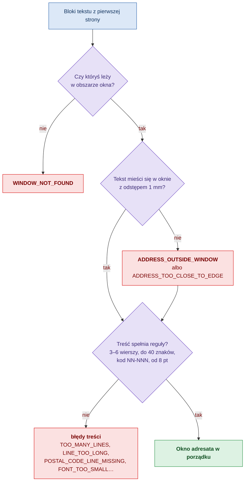
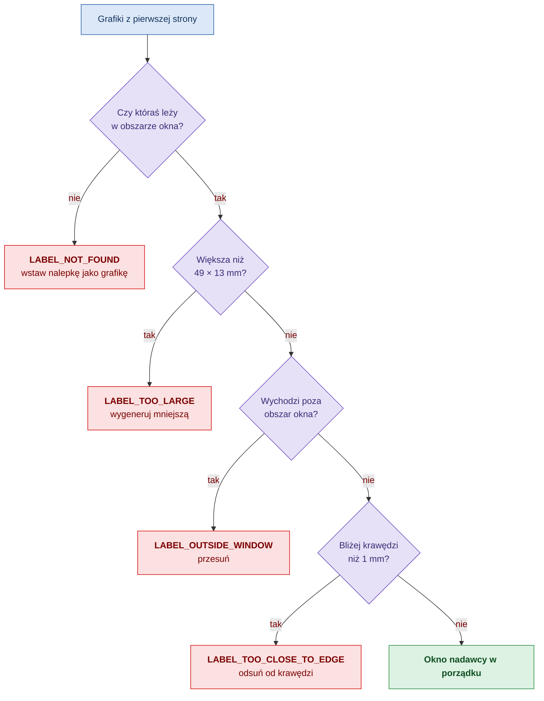
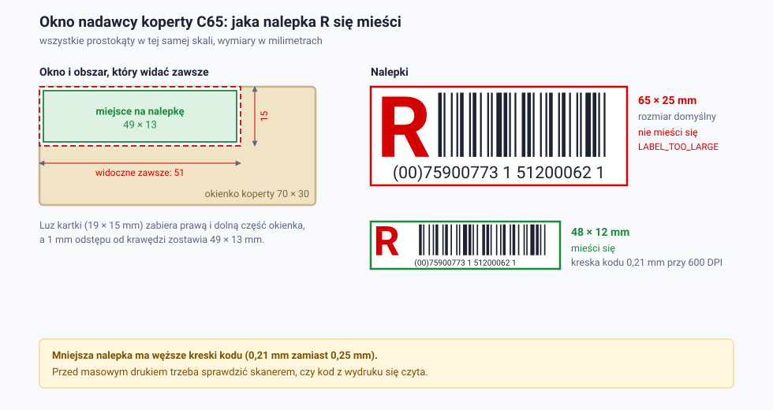
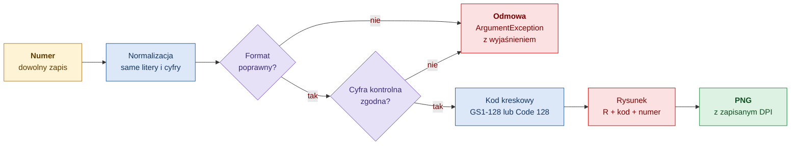
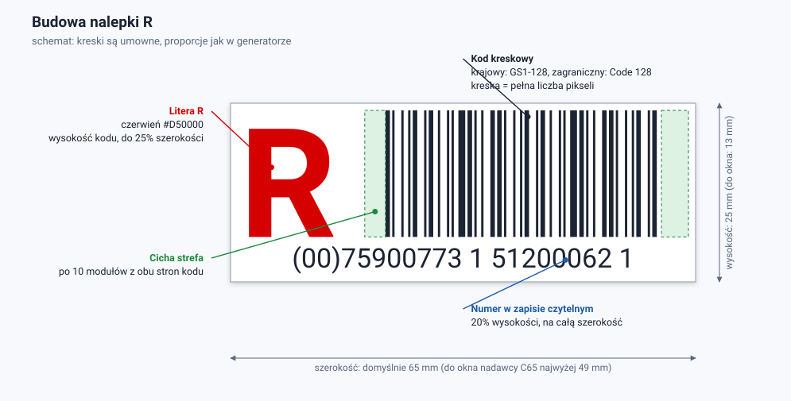

# Jak to działa

Opis mechanizmów: skąd biorą się wymiary okien, jak walidator znajduje adres i nalepkę, jak powstaje grafika nalepki. Dla osób, które chcą rozumieć wynik, a nie tylko go odczytać.

[← Spis dokumentacji](README.md)

## Okna koperty

### Skąd biorą się wymiary

Koperta C65 ma 229×114 mm. Kartka A4 złożona na trzy ma 210×99 mm. Różnica to luz: kartka może przesunąć się w kopercie o **19 mm w poziomie** i **15 mm w pionie**.

Okienko pokazuje więc różne fragmenty strony w zależności od tego, jak kartka się ułoży. Walidator sprawdza tylko **obszar widoczny zawsze**: tę część strony, którą widać w oknie przy każdym położeniu kartki. Jest mniejsza od okna dokładnie o luz.

| | Okno adresata | Okno nadawcy |
|---|---|---|
| Okno na kopercie | 90×45 mm, 20 mm od prawej, 15 mm od dołu | 70×30 mm, 28 mm od lewej, 20 mm od dołu |
| Minus luz 19×15 mm | 71×30 mm | 51×15 mm |
| Obszar widoczny zawsze, na stronie | x 119–190, y 54–84 mm | x 28–79, y 64–79 mm |
| Minus 1 mm odstępu z każdej strony | x 120–189, y 55–83 mm | x 29–78, y 65–78 mm |
| Największa zawartość | 69×28 mm | 49×13 mm |

Po przeniesieniu na stronę pisma:

Odstęp 1 mm to tolerancja druku i składania. Wymiary okien pochodzą ze specyfikacji dostawcy kopert (wzór 1760353344 z jednym okienkiem, 1770196712 z dwoma). Okno adresata jest w obu wzorach takie samo.

### Dlaczego założenie jest ostrożne

Przyjęte założenie (`LetterPlay.AnyPosition`) mówi: nie wiemy, jak kartka leży w kopercie. Daje to pewność, że zawartość będzie widoczna zawsze, kosztem mniejszego obszaru.

Jeśli pisma są kopertowane maszynowo i kartka zawsze leży na środku, można przyjąć `LetterPlay.Centered`. Okno ma wtedy pełny rozmiar, przesunięty o połowę luzu, z odstępem 3 mm. Okno nadawcy mieści wtedy do 64×24 mm. To założenie jest mniej bezpieczne: gdy kartka jednak się przesunie, część zawartości zostanie zasłonięta.

### Inna koperta

Układ nie jest wpisany na stałe. `EnvelopeLayout.FromEnvelope` przyjmuje wymiary koperty i okien tak, jak podaje je dostawca, i sam wylicza obszary na stronie. Gotowe są też układy DL z oknem adresata po lewej (DIN 5008).

## Okno adresata: jak znajdowany i oceniany jest adres

Błąd położenia nie przerywa sprawdzania: treść adresu jest oceniana zawsze, więc jedno sprawdzenie pokazuje wszystkie problemy naraz. Okno jest w porządku tylko wtedy, gdy żadne sprawdzenie nie zgłosiło błędu.

### Znalezienie adresu

1. Walidator zbiera z pierwszej strony wszystkie bloki tekstu i wylicza położenie każdego w milimetrach.
2. Dla okna wybiera blok o najlepszym wyniku: część wspólna z oknem pomnożona przez udział bloku leżący w oknie.

Dzięki drugiemu czynnikowi mały blok adresu, który leży w oknie prawie cały, wygrywa z długim akapitem treści, który tylko o nie zahacza. Walidator **sprawdza miejsce, a nie nazwany element**: nie ma znaczenia, czy adres jest w polu tekstowym, ramce, tabeli czy zwykłym akapicie, ani jak ten element się nazywa.

Jeśli w obszarze okna nie ma żadnego tekstu, wynik to `WINDOW_NOT_FOUND`.

### Ocena położenia

| Sytuacja | Wynik |
|---|---|
| tekst wychodzi poza obszar okna | `ADDRESS_OUTSIDE_WINDOW`, z podaniem strony i odległości |
| tekst jest w obszarze, ale bliżej krawędzi niż 1 mm | `ADDRESS_TOO_CLOSE_TO_EDGE` |
| tekst jest obrócony | `TEXT_ROTATED` |

Liczy się prostokąt opisany na literach, a nie pole tekstowe, w którym stoją. Pole może wystawać poza okno, byle tekst w nim się mieścił.

### Ocena treści

| Reguła | Domyślnie | Skąd |
|---|---|---|
| liczba wierszy | 3–6 | limity wzorowane na zaleceniach Poczty Polskiej dla przesyłek sortowanych automatycznie |
| znaków w wierszu | do 40 | j.w. |
| czcionka | 8–14 pt | j.w. |
| ostatni wiersz | `NN-NNN Miejscowość` | j.w. |
| adres zagraniczny | kraj wielkimi literami pod wierszem z kodem | dozwolony |

Przed wdrożeniem warto porównać limity z aktualną wersją wytycznych Poczty i z umową nadawczą. Każdy limit można zmienić w profilu walidacji.

## Okno nadawcy: jak sprawdzana jest nalepka R

W tym oknie nie ma reguł treści. Walidator odpowiada na dwa pytania.

**Czy nalepka jest?** Zbiera grafiki z pierwszej strony i wybiera tę, która najlepiej pokrywa się z oknem, tą samą miarą co przy adresie. Grafika poza oknem (np. logo w nagłówku) nie jest brana pod uwagę. Brak grafiki w oknie to `LABEL_NOT_FOUND`. Tekst w tym miejscu nie liczy się jako nalepka, a komunikat to zaznacza.

**Czy się mieści?** Sprawdzenia idą w tej kolejności i zgłaszany jest pierwszy problem:

| Kolejność | Sytuacja | Wynik | Czy przesunięcie pomoże |
|---|---|---|---|
| 1 | nalepka jest szersza niż 49 mm lub wyższa niż 13 mm | `LABEL_TOO_LARGE` | nie, trzeba ją zmniejszyć |
| 2 | nalepka ma dobry rozmiar, ale wychodzi poza obszar okna | `LABEL_OUTSIDE_WINDOW` | tak |
| 3 | nalepka jest w obszarze, ale bliżej krawędzi niż 1 mm | `LABEL_TOO_CLOSE_TO_EDGE` | tak |

Rozróżnienie „za duża” i „źle położona” jest celowe: mówi od razu, czy poprawić położenie w szablonie, czy rozmiar generowanej nalepki.

### Czego walidator o nalepce nie wie

- **Nie odczytuje kodu kreskowego ani numeru.** Sprawdza obecność i położenie grafiki. Nie stwierdzi, czy numer jest poprawny ani czy kod da się zeskanować.
- **Nie odróżnia nalepki R od innego obrazu.** Każda grafika w oknie nadawcy jest traktowana jako nalepka.
- **Widzi tylko obrazy rastrowe.** Nalepka narysowana w PDF kształtami wektorowymi albo wpisana czcionką z kodem kreskowym nie zostanie znaleziona.

Poprawność numeru zapewnia wcześniejszy krok: generator nalepek odmawia wygenerowania nalepki dla numeru z błędem.

## Nalepka a okno: co się mieści

To jedyne miejsce, w którym dwa mechanizmy mają sprzeczne wymagania.

| | Wartość |
|---|---|
| Domyślna nalepka z `Mass.RLabel` | 65×25 mm |
| Największa nalepka w oknie nadawcy C65 | 49×13 mm |

Nalepka w domyślnym rozmiarze nie mieści się i zawsze dostaje `LABEL_TOO_LARGE`. Mniejsza nalepka mieści się, ale ma węższe kreski kodu:

| Nalepka | Szerokość najwęższej kreski przy 203 / 300 / 600 DPI | Mieści się |
|---|---|---|
| 65×25 mm | 0,250 / 0,254 / 0,254 mm | nie |
| 49×13 mm | 0,125 / 0,169 / 0,212 mm | tak |

Poniżej ok. 0,25 mm skanery mogą mieć trudności z odczytem. Możliwe wyjścia:

| Wariant | Zaleta | Koszt |
|---|---|---|
| Nalepka 49×13 mm przy 600 DPI | mieści się przy każdym położeniu kartki | kreska 0,21 mm; trzeba potwierdzić odczyt skanerem na wydruku |
| Założenie, że kartka leży na środku (`LetterPlay.Centered`) | mieści się nalepka do 64×24 mm, kreska 0,25 mm | nalepka może być częściowo zasłonięta, gdy kartka się przesunie; domyślne 65×25 mm nadal jest o 1 mm za duże |
| Inna koperta, z większym oknem nadawcy lub mniejszym luzem | pełnowymiarowa nalepka widoczna zawsze | zmiana dostawcy lub wzoru koperty |

Wybór wariantu to decyzja biznesowa, której ta dokumentacja nie przesądza. Pliki przykładowe i testy używają pierwszego wariantu (nalepka 48×12 mm).

## PDF a DOCX: czym różnią się wyniki

| | PDF | DOCX |
|---|---|---|
| Skąd położenie tekstu | zapisane w pliku dla każdej litery | wyliczane z marginesów, kotwic, wcięć i odstępów |
| Szerokość tekstu | z szerokości znaków zapisanych w pliku | szacowana ze średniej szerokości znaku |
| Element zakotwiczony do strony | dokładnie | dokładnie (położenie), tekst w środku szacowany |
| Tekst lub obraz „w tekście” | dokładnie | szacowane z dokładnością 1–3 mm, zgłoszenie `POSITION_ESTIMATED` |
| Podgląd strony | tak | nie |
| Wykrywane podkreślenie | nie | tak |

PDF zawiera gotowy skład strony, DOCX tylko przepis na niego. Dlatego to samo pismo może dać w DOCX wynik różny o ułamki milimetra, a przy elementach „w tekście” o kilka milimetrów.

Praktyczna zasada: **DOCX służy do sprawdzania szablonu, PDF do sprawdzania pisma przed drukiem.**

W DOCX położenie w poziomie wynika wprost z marginesu i wcięcia, więc jest pewne. Położenie w pionie zależy od wysokości wszystkiego, co stoi wyżej na stronie, a tę Word wylicza dopiero przy składzie. Stąd szacowanie.

## Jak powstaje nalepka R

Prawdziwa nalepka z generatora, numer krajowy w rozmiarze domyślnym 65×25 mm:

### Z czego składa się numer

| | Krajowy | Zagraniczny |
|---|---|---|
| Standard | GS1 SSCC | UPU S10 |
| Długość | 20 cyfr | 13 znaków |
| Budowa | `00` + 17 cyfr + cyfra kontrolna | 2 litery + 8 cyfr + cyfra kontrolna + 2 litery kraju |
| Przykład | `00759007731512000621` | `RR473124829PL` |
| Zapis pod kodem | `(00)75900773 1 51200062 1` | `RR 473 124 829 PL` |
| Kod kreskowy | GS1-128 | Code 128 |

Numer można podać w dowolnym zapisie: spacje, nawiasy, myślniki i małe litery są pomijane. `(00) 7 5900773 1 51200062 1` i `00759007731512000621` to ten sam numer.

### Cyfra kontrolna

Cyfra kontrolna jest wyliczana z pozostałych cyfr. Jeśli ktoś pomyli jedną cyfrę przy przepisywaniu, wyliczona cyfra nie zgodzi się z zapisaną i generator odmówi wygenerowania nalepki, podając, jaka cyfra jest, a jaka powinna być.

| | Algorytm |
|---|---|
| Krajowy | GS1 mod 10: 17 cyfr po `00`, od prawej wagi 3, 1, 3, 1…; cyfra kontrolna dopełnia sumę do pełnej dziesiątki |
| Zagraniczny | UPU S10: 8 cyfr z wagami 8, 6, 4, 2, 3, 5, 9, 7; cyfra to 11 minus reszta z dzielenia sumy przez 11, przy czym 10 daje 0, a 11 daje 5 |

Budowę numerów i przykłady do samodzielnego przeliczenia opisuje [ku_ku_lafila.md](../ku_ku_lafila.md).

### Układ grafiki

Układ jest wzorowany na nalepce R Poczty Polskiej i zachowuje proporcje przy dowolnym rozmiarze:

| Element | Zasada |
|---|---|
| Litera R | czerwona (`#D50000`), wysokości kodu kreskowego, w kolumnie do 25% szerokości |
| Kod kreskowy | czarny, wyśrodkowany w pozostałej szerokości |
| Cicha strefa | po 10 modułów pustego miejsca z każdej strony kodu |
| Numer | pod kodem, na całą szerokość, pomniejszany, gdy się nie mieści |
| Tło | białe, bez ramki (ramkę włącza `DrawBorder`) |
| Font | Liberation Sans, osadzony w bibliotece, więc wynik jest taki sam na każdym systemie |

Układ odtworzono ze zdjęcia nalepki, nie z oficjalnego wzoru. Przed drukiem produkcyjnym warto porównać wydruk z egzemplarzem z Poczty.

### Dlaczego kreski są ostre

Najwęższa kreska kodu (moduł) ma zawsze **całkowitą liczbę pikseli**. Generator dzieli dostępną szerokość przez liczbę modułów i zaokrągla w dół, a kod wyśrodkowuje. Kreski nie są wygładzane.

Z tego wynikają dwie rzeczy:

- Szerokość kreski zmienia się skokowo, a nie płynnie z rozmiarem nalepki. Nalepka 49 mm i 48 mm mają tę samą kreskę.
- Obrazu nie wolno skalować w dokumencie. Przeskalowany obraz ma kreski o niecałkowitej szerokości i rozmyte krawędzie. Inny rozmiar uzyskuje się, generując nalepkę ponownie.

### Rozdzielczość a wymiar

Rozmiar w pikselach to wymiar w milimetrach pomnożony przez DPI. Nalepka 48×12 mm przy 600 DPI ma 1134×283 px. DPI jest zapisywane w pliku (PNG i JPEG), więc Word i drukarka wstawiają obraz w rozmiarze 48×12 mm, a nie „na oko”.

| DPI | Kiedy |
|---|---|
| 203 | drukarki termiczne |
| 300 | domyślnie; wystarcza dla nalepki 65×25 mm |
| 600 | nalepki mniejsze niż domyślna, żeby kreska była możliwie szeroka |

### Co generator gwarantuje, a czego nie

| Gwarantuje | Nie gwarantuje |
|---|---|
| numer ma poprawny format i cyfrę kontrolną | że numer jest w puli i nie był użyty |
| kod kreskowy koduje dokładnie ten numer | że kod da się odczytać po wydruku na konkretnej drukarce |
| obraz ma zadany wymiar w mm przy zadanym DPI | że nalepka zmieści się w oknie koperty |
| wynik jest taki sam na Windows i Linux co do wymiarów, DPI i treści kodu | identyczność plików bajt w bajt między systemami |

Pierwszą lukę zamyka pula numerów, drugą próba skanerem, trzecią walidacja pisma.

## Jak mechanizmy się uzupełniają

```mermaid
flowchart LR
    Q1["Numer istnieje<br/>i jest wolny?"]:::num
    Q2["Format i cyfra<br/>kontrolna?"]:::label
    Q3["Kod koduje<br/>ten numer?"]:::label
    Q4["Nalepka jest<br/>i mieści się w oknie?"]:::check
    Q5["Adres w oknie<br/>i poprawny?"]:::check
    Q6["Kod czyta się<br/>z wydruku?"]:::warn
    Q7["Właściwy numer<br/>na właściwym piśmie?"]:::warn

    subgraph POOL["Pula numerów"]
        Q1
    end
    subgraph RL["Generator nalepek"]
        Q2
        Q3
    end
    subgraph AW["Walidacja pisma"]
        Q4
        Q5
    end
    subgraph MAN["Poza automatem"]
        Q6
        Q7
    end

    POOL --> RL --> AW --> MAN

    classDef num fill:#FFF3D6,stroke:#B7791F,color:#5F3B00
    classDef label fill:#FBE1E1,stroke:#D50000,color:#7A0000
    classDef doc fill:#DCE8F7,stroke:#1E5AA8,color:#12345F
    classDef check fill:#E7E1F7,stroke:#6B46C1,color:#3B2A75
    classDef ok fill:#DDF2E3,stroke:#1B8A3A,color:#0F4F21
    classDef bad fill:#FBE1E1,stroke:#D50000,color:#7A0000
    classDef warn fill:#FFF3D6,stroke:#B7791F,color:#5F3B00
```

| Pytanie | Kto odpowiada |
|---|---|
| Czy numer istnieje i jest wolny? | pula numerów (`Rokoko/Mass.Api`) |
| Czy numer ma poprawny format i cyfrę kontrolną? | generator nalepek, przy generowaniu; pula numerów, przy zasilaniu |
| Czy kod kreskowy koduje ten numer? | generator nalepek |
| Czy nalepka jest na piśmie i mieści się w oknie? | walidacja pisma |
| Czy adres jest w oknie i jest poprawny? | walidacja pisma |
| Czy kod kreskowy czyta się z wydruku? | nikt automatycznie; próba skanerem |
| Czy na piśmie jest nalepka z numerem przypisanym do tej przesyłki? | nikt automatycznie; odpowiada za to system, który generuje pismo |
