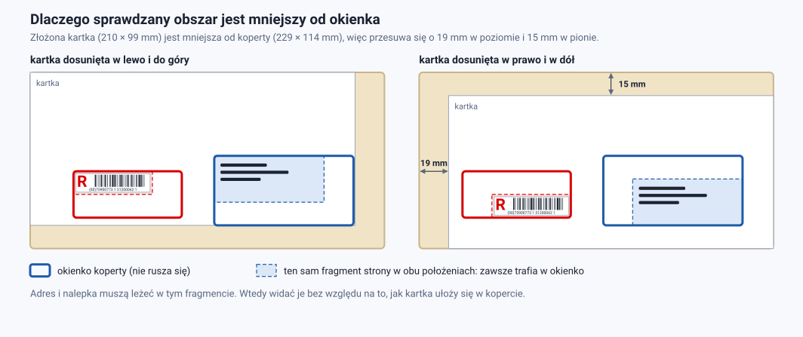
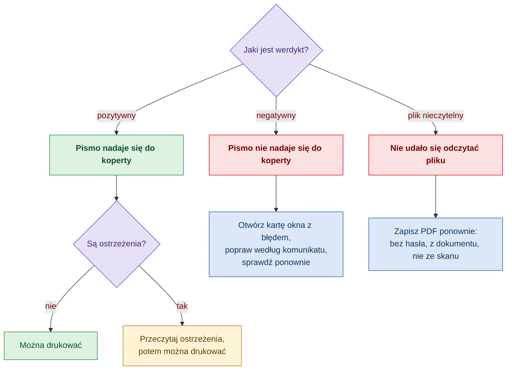
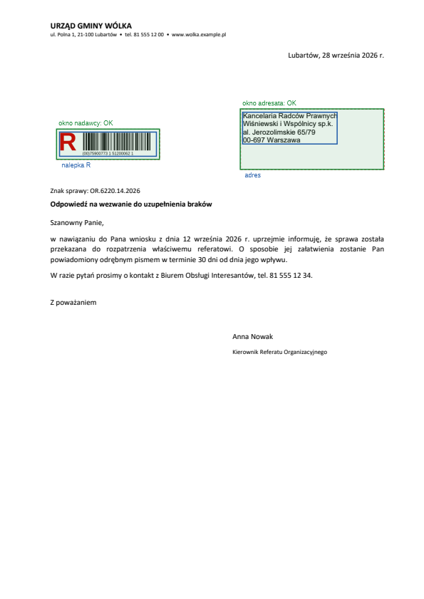
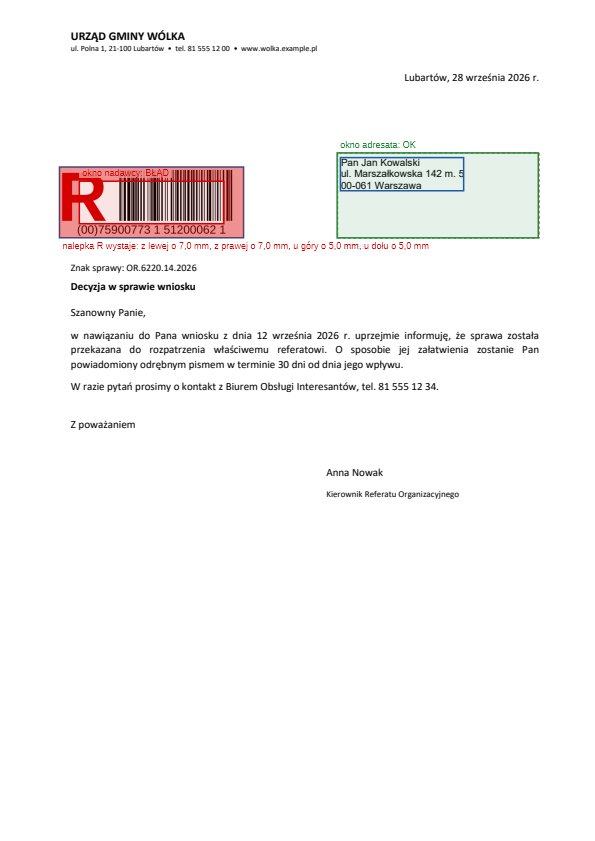
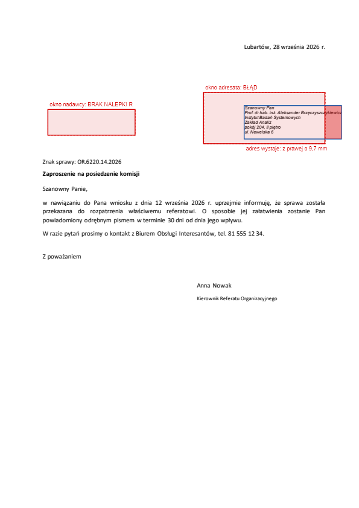

# Przewodnik użytkownika

Dla osób, które przygotowują pisma i szablony, sprawdzają je przed drukiem i czytają wynik walidacji. Nie wymaga znajomości programowania.

[← Spis dokumentacji](README.md)

## Co jest sprawdzane

Tylko **pierwsza strona** pisma, bo tylko ją widać w okienkach koperty. Walidacja odpowiada na dwa pytania:

1. **Okno adresata:** czy jest w nim adres, czy cały mieści się w oknie i czy jego treść spełnia reguły adresowania?
2. **Okno nadawcy** (tylko koperta z dwoma okienkami): czy jest w nim nalepka R i czy cała mieści się w oknie?

W oknie nadawcy **nie są sprawdzane żadne dane adresowe**. Adres nadawcy wpisany w tym miejscu nie zastępuje nalepki i daje błąd.

Walidacja nie sprawdza reszty pisma: treści, podpisów, kolejnych stron ani tego, czy numer na nalepce jest właściwy dla tej przesyłki.

## Gdzie na stronie ma być adres, a gdzie nalepka


| | Adres adresata | Nalepka R |
|---|---|---|
| Od lewej krawędzi strony | 120–189 mm | 29–78 mm |
| Od górnej krawędzi strony | 55–83 mm | 65–78 mm |
| Największy rozmiar | 69×28 mm | 49×13 mm |

To, co wyjdzie poza te granice choćby o ułamek milimetra, jest błędem. Granice są węższe niż samo okienko koperty, bo kartka przesuwa się w kopercie: liczy się tylko ta część strony, którą widać przy każdym jej położeniu.



## Jak przygotować adres adresata

| Reguła | Wymaganie | Skutek złamania |
|---|---|---|
| Liczba wierszy | od 3 do 6 | błąd |
| Długość wiersza | najwyżej 40 znaków | błąd |
| Ostatni wiersz | kod pocztowy `NN-NNN`, spacja, miejscowość | błąd |
| Adres zagraniczny | pod wierszem z kodem może być nazwa kraju WIELKIMI LITERAMI | dozwolone |
| Wielkość czcionki | co najmniej 8 pt | błąd |
| Wielkość czcionki | najwyżej 14 pt | ostrzeżenie |
| Kierunek tekstu | poziomo, bez obrotu | błąd |
| Krój | bez kursywy i podkreślenia | ostrzeżenie |
| Wyrównanie | do lewej | ostrzeżenie |
| Puste wiersze w środku adresu | brak | ostrzeżenie |

Przykład poprawnego adresu:

```
Pan Jan Kowalski
ul. Marszałkowska 142 m. 5
00-061 Warszawa
```

Najczęstsze pomyłki: kod zapisany jako `00061` zamiast `00-061`, tytuł grzecznościowy i dane instytucji rozbite na siedem wierszy, zbyt długa nazwa w jednym wierszu, czcionka zmniejszona do 7 pt, żeby „się zmieściło”.

**W dokumencie Word** umieść adres w polu tekstowym albo w ramce **zakotwiczonej do strony**, w podanych wyżej granicach. Wtedy położenie jest pewne. Adres ustawiony odstępami i wcięciami zwykłych akapitów też zostanie znaleziony, ale jego położenie jest tylko szacowane (z dokładnością 1–3 mm) i przesuwa się, gdy ktoś zmieni cokolwiek powyżej.

## Jak wstawić nalepkę R

Nalepka R musi być **grafiką** (obrazem), nie tekstem.

1. Użyj grafiki wygenerowanej w rozmiarze, w jakim ma być wydrukowana: najwyżej **49×13 mm**. Nie zmniejszaj większej nalepki przez przeciąganie rogu obrazu, bo kreski kodu stracą ostrość.
2. Ustaw ją tak, żeby cała leżała w obszarze 29–78 mm od lewej i 65–78 mm od góry strony. Przykład: nalepka 48×12 mm z lewym górnym rogiem w punkcie (29,5; 65,5).
3. W tym miejscu nie umieszczaj żadnego tekstu. Tekst obok nalepki w oknie daje ostrzeżenie.

**W programie Word:** wstaw obraz (Wstawianie → Obrazy), ustaw mu zawijanie tekstu „Przed tekstem”, a w oknie „Więcej opcji układu” na karcie „Położenie” wybierz położenie bezwzględne w poziomie i w pionie liczone **od strony** (np. 2,95 cm na prawo od strony i 6,55 cm poniżej strony). Obraz wstawiony „w tekście” też zostanie znaleziony, ale jego położenie jest szacowane.

> **Uwaga na rozmiar.** Nalepka w domyślnym rozmiarze generatora (65×25 mm) nie mieści się w oknie nadawcy koperty C65 i zawsze daje błąd `LABEL_TOO_LARGE`. Mniejsza nalepka ma węższe kreski kodu. Zanim nalepki w rozmiarze 49×13 mm pójdą do masowego druku, wydrukuj próbną i sprawdź, czy skaner ją czyta.

## Jak sprawdzić pismo w aplikacji

Aplikacja przyjmuje pliki **PDF**. Sprawdzaj plik, który faktycznie trafi do druku.

1. **Wybierz rodzaj koperty.**
   - *Jedno okienko*: sprawdzany jest tylko adres adresata.
   - *Dwa okienka*: sprawdzany jest adres adresata i nalepka R w oknie nadawcy.
2. **Kliknij „Wczytaj plik PDF”** i wskaż plik (do 20 MB). Plik jest wysyłany i sprawdzany od razu.
3. **Przeczytaj wynik.** Zmiana rodzaju koperty sprawdza ten sam plik ponownie, bez wczytywania go drugi raz.

To samo pismo może być poprawne dla koperty z jednym okienkiem i niepoprawne dla koperty z dwoma, jeśli nie ma na nim nalepki R.

## Jak czytać wynik



**Werdykt** na górze mówi wprost, czy pismo nadaje się do koperty:

| Werdykt | Znaczenie |
|---|---|
| „Pismo nadaje się do koperty.” | Wszystkie sprawdzane okna są w porządku. Mogą być ostrzeżenia. |
| „Pismo nie nadaje się do koperty.” | Jest co najmniej jeden błąd. Trzeba poprawić pismo. |
| „Nie udało się odczytać pliku.” | Plik jest uszkodzony albo zabezpieczony hasłem. |

**Każde okno** ma własną kartę ze statusem:

| Status | Znaczenie |
|---|---|
| OK | W oknie jest to, co trzeba, i mieści się. |
| błąd | Adres lub nalepka jest, ale wystaje albo łamie reguły. |
| brak adresu | W oknie adresata nie ma tekstu. |
| brak nalepki R | W oknie nadawcy nie ma grafiki. |

Pod statusem widać, co wykryto: wiersze adresu i wielkość czcionki albo rozmiar nalepki. Jeśli coś wystaje, karta podaje stronę i odległość, np. „z prawej o 9,7 mm”.

**Zgłoszenia** mają trzy wagi:

| Waga | Czy pismo przechodzi | Co zrobić |
|---|---|---|
| błąd | nie | poprawić |
| ostrzeżenie | tak | przeczytać i ocenić; zwykle dotyczy czytelności dla maszyn sortujących |
| informacja | tak | nic; wyjaśnia, jak powstał wynik |

Każde zgłoszenie ma stały kod, np. `ADDRESS_OUTSIDE_WINDOW`. Znaczenie kodów i sposób poprawy: [Zgłoszenia walidacji](zgloszenia.md).

**Podgląd strony** po prawej pokazuje pierwszą stronę z naniesionymi oznaczeniami:

| Oznaczenie | Znaczenie |
|---|---|
| zielony prostokąt | okno w porządku |
| czerwony prostokąt | okno z błędem albo puste |
| niebieska ramka | wykryty adres albo nalepka R |
| czerwone wypełnienie | część adresu lub nalepki, która wystaje poza okno |

### Przykłady podglądu

Podglądy trzech pism przykładowych sprawdzonych w trybie dwóch okienek:

| Wszystko w porządku | Nalepka R za duża | Błędy adresu, brak nalepki |
|---|---|---|
|  |  |  |
| plik 02 | plik 05: `LABEL_TOO_LARGE` | plik 03: `ADDRESS_OUTSIDE_WINDOW`, `LABEL_NOT_FOUND` |

## Pytania i odpowiedzi

**Czy adres nadawcy może być w oknie nadawcy?**
Nie. W tym oknie ma być nalepka R. Dane nadawcy umieść poza oknami, np. w nagłówku strony.

**Pismo idzie w kopercie z jednym okienkiem. Czy potrzebuje nalepki R na stronie?**
Nie. W trybie jednego okienka okno nadawcy nie jest sprawdzane.

**Nalepka jest na stronie, a wynik mówi „brak nalepki R”. Dlaczego?**
Najczęściej z jednego z trzech powodów: nalepka leży w całości poza obszarem okna, jest wstawiona jako tekst lub czcionka z kodem kreskowym, a nie jako obraz, albo w PDF została narysowana jako kształty wektorowe, a nie obraz.

**Czy walidacja sprawdza, czy kod kreskowy da się odczytać i czy numer jest poprawny?**
Nie. Sprawdza tylko, czy w oknie jest grafika i czy się mieści. Poprawność numeru (format i cyfra kontrolna) jest sprawdzana wcześniej, przy generowaniu nalepki. Czytelność kodu trzeba sprawdzić skanerem na wydruku.

**Czy walidacja odróżni nalepkę R od innego obrazka?**
Nie. Każda grafika w oknie nadawcy jest traktowana jako nalepka. Logo poza oknem nie przeszkadza.

**Adres wygląda dobrze na ekranie, a wynik mówi, że wystaje. Kto ma rację?**
Wynik. Okienko koperty jest większe od obszaru, który sprawdzamy, ale kartka przesuwa się w kopercie nawet o 19 mm w poziomie i 15 mm w pionie. Adres „na styk” będzie zasłonięty w części kopert.

**Mam skan pisma w PDF. Czy mogę go sprawdzić?**
Nie. Skan nie ma warstwy tekstowej, więc adresu nie da się odczytać. Wynik to błąd `NO_TEXT_LAYER`.

**Wynik ma ostrzeżenia, ale werdykt jest pozytywny. Czy mogę drukować?**
Tak. Ostrzeżenia nie blokują. Warto je przeczytać, bo dotyczą głównie tego, czy maszyna sortująca odczyta adres.

**Szablon ma pola korespondencji seryjnej zamiast prawdziwego adresu. Czy mogę go sprawdzić?**
Tak. Walidacja rozpozna pola (np. `«Miasto»`) i braki kodu pocztowego zgłosi jako ostrzeżenia zamiast błędów. Położenie i rozmiar pola są sprawdzane normalnie. Ostateczne sprawdzenie zrób na piśmie z prawdziwymi danymi.

**Pismo ma inny format niż A4 w pionie. Co wtedy?**
Wynik dostanie ostrzeżenie `UNEXPECTED_PAGE_FORMAT`. Położenia okien są wyliczone dla A4, więc dla innego formatu wynik nie jest wiarygodny.

**Gdzie znajdę pliki do prób?**
W katalogu `Mass/AddressWindow/samples`: pięć pism w wersji DOCX i PDF, w tym pismo poprawne z nalepką, pismo z błędami adresu i pismo ze zbyt dużą nalepką. Oczekiwane wyniki opisuje [samples/README.md](../AddressWindow/samples/README.md).
