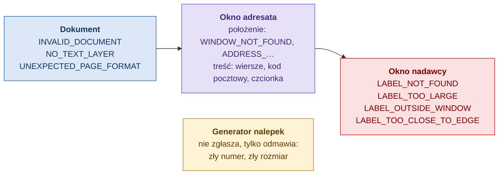

# Zgłoszenia walidacji

Pełna lista kodów, które może zwrócić walidacja pisma: co znaczą i co poprawić. Kody są stałe i takie same dla PDF i DOCX, więc można na nich opierać logikę integracji. Komunikaty są po polsku i zawierają konkretne wartości (która strona, o ile milimetrów, który wiersz).

[← Spis dokumentacji](README.md)

## Wagi

| Waga | Wartość w wyniku | Czy pismo przechodzi |
|---|---|---|
| błąd | `Error` | nie |
| ostrzeżenie | `Warning` | tak |
| informacja | `Info` | tak |

Pismo jest poprawne (`isValid`), gdy plik dało się odczytać, w każdym sprawdzanym oknie coś znaleziono i nie ma ani jednego błędu.

## Dokument

Dotyczą całego pliku, a nie konkretnego okna.

| Kod | Waga | Co znaczy | Co zrobić |
|---|---|---|---|
| `INVALID_DOCUMENT` | błąd | Pliku nie da się odczytać: jest uszkodzony, zabezpieczony hasłem albo nie jest tym, na co wygląda. Żadne okno nie zostało sprawdzone. | Zapisz plik ponownie bez hasła. Dla Worda użyj formatu DOCX, nie DOC. |
| `NO_TEXT_LAYER` | błąd | (PDF) Strona nie ma tekstu: to skan albo tekst zamieniony na krzywe. | Wygeneruj PDF z dokumentu źródłowego, a nie ze skanu. |
| `UNEXPECTED_PAGE_FORMAT` | ostrzeżenie | Strona nie jest A4 w pionie. Położenia okien mogą się nie zgadzać. | Ustaw format A4 w pionie. |

## Okno adresata: położenie

| Kod | Waga | Co znaczy | Co zrobić |
|---|---|---|---|
| `WINDOW_NOT_FOUND` | błąd | W obszarze okna nie ma żadnego tekstu. | Przesuń adres w obszar okna: 120–189 mm od lewej, 55–83 mm od góry. |
| `ADDRESS_OUTSIDE_WINDOW` | błąd | Tekst adresu wychodzi poza okno. Komunikat podaje stronę i odległość. | Przesuń adres o podaną odległość albo skróć najdłuższy wiersz. |
| `ADDRESS_TOO_CLOSE_TO_EDGE` | błąd | Adres jest w oknie, ale bliżej krawędzi niż 1 mm. Przy przesunięciu kartki zostałby zasłonięty. | Odsuń adres od wskazanej krawędzi. |
| `TEXT_ROTATED` | błąd | Tekst adresu jest obrócony albo pionowy. | Ustaw tekst poziomo. |
| `TEXT_OVERFLOWS_CONTAINER` | ostrzeżenie | (DOCX) Tekst jest wyższy niż pole tekstowe o stałej wysokości. Word utnie ostatnie wiersze. | Powiększ pole albo skróć adres. |
| `OTHER_TEXT_IN_WINDOW` | ostrzeżenie | W oknie oprócz adresu widać inny tekst. | Przesuń ten tekst poza okno. |
| `POSITION_ESTIMATED` | informacja | (DOCX) Położenie wyliczono w przybliżeniu, bo adres jest zwykłym tekstem w treści, a nie elementem zakotwiczonym do strony. | Dla pewnego wyniku umieść adres w polu tekstowym lub ramce zakotwiczonej do strony albo sprawdź PDF. |

## Okno adresata: treść adresu

| Kod | Waga | Co znaczy | Co zrobić |
|---|---|---|---|
| `ADDRESS_EMPTY` | błąd | Blok adresowy nie zawiera tekstu. | Wpisz adres. |
| `TOO_FEW_LINES` | błąd | Adres ma mniej niż 3 wiersze. | Uzupełnij adres: adresat, ulica z numerem, kod z miejscowością. |
| `TOO_MANY_LINES` | błąd | Adres ma więcej niż 6 wierszy. | Połącz lub usuń wiersze, np. tytuł z nazwiskiem. |
| `LINE_TOO_LONG` | błąd | Wiersz ma więcej niż 40 znaków. Komunikat podaje numer wiersza i jego treść. | Skróć wiersz albo podziel go na dwa. |
| `POSTAL_CODE_LINE_MISSING` | błąd | Ostatni wiersz nie ma postaci „NN-NNN Miejscowość”. Jeśli walidator znajdzie kod w złym zapisie (np. `01447`), komunikat to podaje. | Zapisz kod z myślnikiem, na początku ostatniego wiersza. |
| `TEXT_AFTER_POSTAL_CODE_LINE` | błąd | Wiersz z kodem pocztowym nie jest ostatni. Pod nim może być tylko nazwa kraju wielkimi literami. | Przenieś dodatkowe wiersze nad wiersz z kodem. |
| `FONT_TOO_SMALL` | błąd | Czcionka jest mniejsza niż 8 pt. | Zwiększ czcionkę. Jeśli adres się wtedy nie mieści, skróć go. |
| `FONT_TOO_LARGE` | ostrzeżenie | Czcionka jest większa niż 14 pt. | Zmniejsz czcionkę. |
| `LINE_WRAPS` | ostrzeżenie | (DOCX) Wiersz prawdopodobnie nie zmieści się w szerokości pola i zostanie zawinięty. | Skróć wiersz albo poszerz pole. |
| `DECORATED_TEXT` | ostrzeżenie | Adres jest pisany kursywą lub podkreślony. W PDF wykrywana jest tylko kursywa. | Użyj zwykłego kroju. |
| `NON_LEFT_ALIGNMENT` | ostrzeżenie | Adres jest wyśrodkowany albo wyrównany do prawej. | Wyrównaj do lewej. |
| `UNUSUAL_CHARACTERS` | ostrzeżenie | Adres zawiera nietypowe znaki, które mogą utrudnić odczyt maszynowy. | Usuń znaki ozdobne. |
| `EMPTY_LINE_INSIDE` | ostrzeżenie | W środku adresu jest pusty wiersz. | Usuń pusty wiersz. |
| `MERGE_FIELDS_PRESENT` | ostrzeżenie | Adres zawiera pola korespondencji seryjnej (`«Pole»`, `{{pole}}`). Błędy kodu pocztowego są wtedy zgłaszane jako ostrzeżenia. | Nic, jeśli sprawdzasz szablon. Pismo z danymi sprawdź osobno. |

## Okno nadawcy: nalepka R

Występują tylko w trybie dwóch okienek. W tym oknie nie ma reguł treści.

| Kod | Waga | Co znaczy | Co zrobić |
|---|---|---|---|
| `LABEL_NOT_FOUND` | błąd | W obszarze okna nie ma grafiki. Jeśli jest tam tekst, komunikat dodaje, że nalepka musi być grafiką. | Wstaw nalepkę R jako obraz w obszarze 29–78 mm od lewej, 65–78 mm od góry. Usuń stamtąd adres nadawcy. |
| `LABEL_TOO_LARGE` | błąd | Nalepka jest większa niż obszar okna, więc nie zmieści się w żadnym położeniu. Komunikat podaje rozmiar nalepki i największy dopuszczalny. | Wygeneruj mniejszą nalepkę: najwyżej 49×13 mm. |
| `LABEL_OUTSIDE_WINDOW` | błąd | Nalepka ma dobry rozmiar, ale wychodzi poza okno. Komunikat podaje stronę i odległość. | Przesuń nalepkę o podaną odległość. |
| `LABEL_TOO_CLOSE_TO_EDGE` | błąd | Nalepka jest w oknie, ale bliżej krawędzi niż 1 mm. | Odsuń nalepkę od wskazanej krawędzi. |
| `OTHER_TEXT_IN_WINDOW` | ostrzeżenie | Obok nalepki w oknie widać tekst. | Przesuń tekst poza okno. |
| `POSITION_ESTIMATED` | informacja | (DOCX) Nalepka jest wstawiona „w tekście”, więc jej położenie wyliczono w przybliżeniu. | Ustaw obraz „Przed tekstem” z położeniem względem strony albo sprawdź PDF. |

Jeśli profil walidacji przełączono na sprawdzanie adresu nadawcy (`SenderWindowContent = Address`, patrz [Integracja](integracja.md#opcje-walidacji)), w oknie nadawcy pojawiają się kody z tabel okna adresata, z limitem 2–5 wierszy.

## Błędy przy generowaniu nalepki

Generator nalepek nie zwraca zgłoszeń, tylko odmawia wygenerowania nalepki (wyjątek `ArgumentException` z komunikatem po polsku). Nalepka z błędnym numerem byłaby bezwartościowa, więc nie powstaje.

| Sytuacja | Przykład komunikatu | Co zrobić |
|---|---|---|
| Zła cyfra kontrolna | „Numer „00759007731512000622” ma złą cyfrę kontrolną: jest 2, powinna być 1.” | Sprawdź numer: to prawie zawsze literówka. |
| Zła długość numeru krajowego | „Numer krajowy musi mieć 20 cyfr (SSCC z identyfikatorem aplikacji 00), a „1234” ma 4 znaków.” | Podaj pełny numer z „00” na początku. |
| Numer krajowy bez „00” | „Numer krajowy musi zaczynać się od identyfikatora aplikacji GS1 „00”…” | Dodaj „00” na początku. |
| Zły format numeru zagranicznego | „Numer zagraniczny musi mieć postać UPU S10: 2 litery, 9 cyfr, 2 litery kraju (np. RR473124829PL)…” | Popraw numer albo rodzaj przesyłki. |
| Wymiary poza zakresem | „Wymiary nalepki muszą być w zakresie 0–500 mm…” | Podaj wymiary w milimetrach. |
| DPI poza zakresem | „Rozdzielczość musi być w zakresie 72–2400 DPI…” | Użyj 203, 300 lub 600. |
| Za mało pikseli na kod | „Nalepka … mm przy … DPI ma za mało pikseli na kod kreskowy. Zwiększ szerokość albo DPI.” | Zwiększ DPI albo szerokość. |
